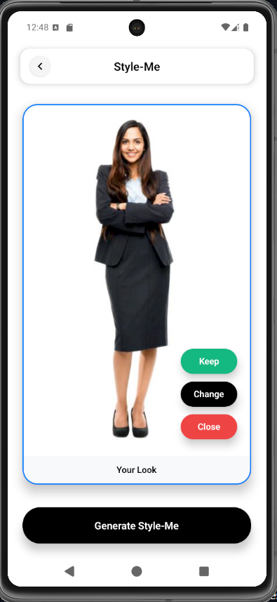

# FitMirror

<div align="center">
  
  <br/>
  <h3>AI-Powered Virtual Try-On Experience</h3>
  <em>Transform your shopping experience with intelligent fashion visualization</em>
</div>

---

## Overview

**FitMirror** is a cutting-edge mobile application that revolutionizes online shopping by allowing users to virtually try on clothing items using advanced AI technology. Built with React Native and Expo, it provides a seamless, intuitive experience for visualizing how clothes will look before making a purchase.

---

## Screenshots

<div align="center">
  
  
  
  
</div>

<div align="center">
  <em>Camera Interface • Style-Me Try-On • Gallery Management • Settings & Configuration</em>
</div>

---

## ✨ Key Features

### **Core Functionality**
- 📸 **Smart Camera Interface**: Capture user photos and clothing items with "Snap your look" functionality
- 🎨 **AI-Powered Style-Me**: Generate realistic virtual try-on results using advanced Fal.ai API
- 🖼️ **Intelligent Gallery**: Organize and manage captured images with intuitive gallery view
- 💾 **Local Storage**: Save and share results with seamless device integration
- 🔄 **Dual-Mode Processing**: Support for both "Your Look" and "Your Item" capture modes

### **User Experience**
- 🎯 **Intuitive Navigation**: Clean tab-based navigation (Style-Me, Gallery, Settings)
- ⚡ **Real-Time Processing**: Live camera preview with instant visual feedback
- 🌟 **Modern Design**: Sleek interface with smooth animations and transitions
- 🔧 **Comprehensive Settings**: Account management, API configuration, and privacy controls
- 📱 **Cross-Platform**: Native performance on both iOS and Android

### **Technical Excellence**
- 🔒 **Secure Configuration**: In-app API key management with connection testing
- 🚀 **Performance Optimized**: Image compression, resizing, and memory management
- 📡 **Offline Capability**: Local caching and storage for uninterrupted usage
- 🛡️ **Privacy First**: Clear cache functionality and data management controls
- 📊 **Account Integration**: User profile management with customizable settings

---

## 🚀 Quick Start

### Prerequisites
```bash
# Required tools
- Node.js (v16+)
- npm or yarn
- Expo CLI
- iOS Simulator or Android Emulator

# Required API Keys
- Fal.ai API key (for virtual try-on functionality)
```

### Installation

1. **Clone the repository**
   ```bash
   git clone https://github.com/your-username/FitMirror.git
   cd FitMirror
   ```

2. **Install dependencies**
   ```bash
   npm install
   ```

3. **Configure environment** (Optional - can also configure in-app)
   ```bash
   cp .env.example .env
   ```
   
   Edit `.env` and add your API key:
   ```env
   # Fal.ai API for virtual try-on (can also be set in Settings)
   FAL_API_KEY=your_fal_api_key_here
   
   EXPO_PUBLIC_APP_NAME=FitMirror
   EXPO_PUBLIC_APP_VERSION=1.0.0
   ```

4. **Start development server**
   ```bash
   npx expo start
   ```

5. **Launch on device**
   - **iOS**: Press `i` or scan QR code with Camera app
   - **Android**: Press `a` or scan QR code with Expo Go app
   - **Web**: Press `w` (limited functionality)

---

## 📱 Usage Guide

### **Getting Started with Style-Me**
1. **Launch App**: Open FitMirror and navigate to the Style-Me tab
2. **Capture Your Look**: Use "Snap your look" to take a photo of yourself
3. **Add Your Item**: Capture or select a clothing item you want to try on
4. **Generate Magic**: Tap "Generate Style-Me" to create your virtual try-on
5. **Save & Share**: Review results and save to your gallery

### **Camera Interface**
- **Flash Control**: Toggle flash for optimal lighting
- **Photo Gallery**: Quick access to existing photos
- **Mode Selection**: Switch between "Outfit" and "Look" capture modes
- **Capture Button**: Large, intuitive capture button for easy use

### **Gallery Management**
- **View Results**: Browse all your Style-Me creations
- **Start New Session**: Quick access to begin new try-on sessions
- **Organization**: Clean, grid-based layout for easy navigation
- **Share Options**: Export and share your favorite looks

### **Settings & Configuration**
- **Account Management**: Customize your profile and personal information
- **API Configuration**: Enter and test your Fal.ai API key
- **Connection Status**: Real-time API connection monitoring
- **Privacy Controls**: Clear cache and manage stored data
- **Quick Access**: Direct link to get Fal.ai API key

---

## 🏗️ Architecture

### Project Structure
```
FitMirror/
├── app/
│   ├── (tabs)/
│   │   ├── index.tsx          # Style-Me interface & camera
│   │   ├── gallery.tsx        # Gallery management & viewing
│   │   ├── settings.tsx       # Settings & configuration
│   │   └── _layout.tsx        # Tab navigation layout
│   ├── processing.tsx         # AI processing & status
│   ├── result.tsx            # Result display & sharing
│   ├── edit-profile.tsx      # User profile management
│   └── _layout.tsx           # Root navigation layout
├── services/
│   ├── fal.ts                # Fal.ai API integration
│   └── storage.ts            # Local data management
├── components/               # Reusable UI components
├── assets/                   # Images, icons, fonts
├── appimages/               # App screenshots & assets
└── utils/                    # Helper functions & utilities
```

### Technology Stack
- **Frontend**: React Native, Expo SDK 53+
- **Navigation**: Expo Router (file-based routing) + Tab Navigation
- **UI Framework**: Native components with modern styling
- **Image Processing**: Expo Image, Image Manipulator, Camera
- **AI Integration**: Fal.ai API for virtual try-on generation
- **Storage**: AsyncStorage, Expo FileSystem
- **Icons**: SF Symbols (iOS) / Material Icons (Android)
- **State Management**: React Context and local state

---

## 🤖 AI Integration

FitMirror uses **Fal.ai** for realistic virtual try-on generation:

### Features
- **Advanced Try-On**: Fal.ai's latest models for realistic clothing fitting
- **Dual Input Support**: Process both user photos and clothing items
- **Real-time Status**: Live connection monitoring and testing
- **Error Handling**: Robust fallback mechanisms and retry logic
- **Rate Limiting**: Built-in request throttling and queue management

### API Configuration

**Option 1: Configure via App Settings (Recommended)**
1. Launch the app and go to **Settings** tab
2. Scroll to **API Configuration** section
3. Enter your Fal.ai API key (get one at [fal.ai/dashboard/keys](https://fal.ai/dashboard/keys))
4. Test connection using the connection status indicator
5. Start using Style-Me features immediately

**Option 2: Environment Variables**
1. Sign up at [Fal.ai](https://fal.ai/dashboard/keys) for virtual try-on API
2. Add key to `.env` file (see installation steps above)
3. Restart the development server

---

## 🛠️ Development

### Running in Development
```bash
# Start with different options
npx expo start                 # Development server
npx expo start --ios          # iOS simulator
npx expo start --android      # Android emulator
npx expo start --web          # Web browser (limited)
npx expo start --tunnel       # Public URL for testing
```

### Building for Production
```bash
# Modern EAS Build (recommended)
npx eas build -p ios          # iOS build
npx eas build -p android      # Android build
npx eas build -p all          # Both platforms

# Legacy Expo Build
npx expo build:ios            # iOS build
npx expo build:android        # Android APK
```

### Testing & Quality Assurance
```bash
# Linting & Code Quality
npx expo lint                  # ESLint check
npm run typecheck             # TypeScript validation

# Testing Features
# - Camera functionality on physical devices
# - API integration with valid keys
# - Style-Me generation workflow
# - Gallery management features
# - Settings and account management
# - Cross-platform compatibility
```

---

## ⚙️ Configuration

### Environment Variables
```env
# API Configuration (can also be set in app settings)
FAL_API_KEY=your_fal_api_key_here

# App Configuration
EXPO_PUBLIC_APP_NAME=FitMirror
EXPO_PUBLIC_APP_VERSION=1.0.0
```

### App Configuration
Key settings in `app.json`:
```json
{
  "expo": {
    "name": "FitMirror",
    "slug": "fitmirror", 
    "scheme": "fitmirror",
    "platforms": ["ios", "android", "web"],
    "icon": "./appimages/logo.png"
  }
}
```

---

## 🔧 Troubleshooting

### Common Issues & Solutions

**Camera Not Working**
- Verify camera permissions in device settings
- Test on physical device (simulators have limited camera support)
- Restart the app if camera appears frozen
- Check "Snap your look" button responsiveness

**API Connection Issues**
- Verify Fal.ai API key in **Settings > API Configuration**
- Check connection status indicator (should show "Connected")
- Test API connection using the built-in test functionality
- Review API usage limits and billing status at fal.ai dashboard
- Ensure network connectivity and firewall settings

**Style-Me Generation Failures**
- Ensure both "Your Look" and "Your Item" images are captured
- Check image quality and lighting conditions
- Verify API key is active and has sufficient credits
- Try clearing cache in **Settings > Privacy & Data**

**App Performance Issues**
- Use "Clear Cache" in Settings > Privacy & Data
- Close other apps to free memory
- Reduce image resolution for faster processing
- Update to latest Expo SDK version

**Build Failures**
```bash
# Clear cache and reinstall
npm cache clean --force
rm -rf node_modules package-lock.json
npm install

# Update Expo CLI
npm install -g @expo/cli@latest
```

---

## 🤝 Contributing

We welcome contributions! Here's how to get started:

1. **Fork** the repository
2. **Create** a feature branch (`git checkout -b feature/amazing-feature`)
3. **Commit** your changes (`git commit -m 'Add amazing feature'`)
4. **Push** to the branch (`git push origin feature/amazing-feature`)
5. **Open** a Pull Request

### Development Guidelines
- Follow TypeScript best practices
- Maintain consistent code styling with `npx expo lint`
- Test new features on both iOS and Android
- Update documentation and screenshots as needed
- Ensure API integrations work correctly

---

## 🗺️ Roadmap

### **Short Term (v1.1)**
- [ ] Batch Style-Me processing for multiple items
- [ ] Enhanced gallery filtering and search
- [ ] Style history and favorites
- [ ] Export quality settings and formats

### **Medium Term (v1.5)**
- [ ] Cloud sync and backup functionality
- [ ] Social sharing and community features
- [ ] Outfit recommendation engine
- [ ] Advanced image editing tools
- [ ] Multiple AI model support

### **Long Term (v2.0)**
- [ ] 3D virtual try-on capabilities
- [ ] AR integration for real-time try-on
- [ ] Multi-user collaboration features
- [ ] Brand partnerships and integrations
- [ ] AI-powered style recommendations

---

## 📄 License

This project is licensed under the **MIT License** - see the [LICENSE](LICENSE) file for details.

---

## 🙏 Acknowledgments

### Powered By
- **[Expo](https://expo.dev/)** - Universal React development platform
- **[Fal.ai](https://fal.ai/)** - AI-powered virtual try-on technology
- **[React Native](https://reactnative.dev/)** - Cross-platform mobile framework

### Design Inspiration
- **[SF Symbols](https://developer.apple.com/sf-symbols/)** - Beautiful iconography
- **[Material Design](https://material.io/)** - Modern UI patterns
- **[React Native Community](https://reactnative.dev/)** - Development best practices

---

## 📞 Support & Contact

### **Issues & Bug Reports**
Create an issue on [GitHub Issues](https://github.com/your-username/FitMirror/issues)

### **Questions & Discussions**
- Check existing [Discussions](https://github.com/your-username/FitMirror/discussions)
- Review [Documentation](https://github.com/your-username/FitMirror/wiki)

### **Additional Resources**
- [Expo Documentation](https://docs.expo.dev/)
- [React Native Docs](https://reactnative.dev/docs/getting-started)
- [Fal.ai Documentation](https://fal.ai/docs)

---

<div align="center">
  
  <br/>
  <strong>Made with cutting-edge AI technology</strong>
  <br/>
  <em>Transform your shopping experience with FitMirror</em>
</div>